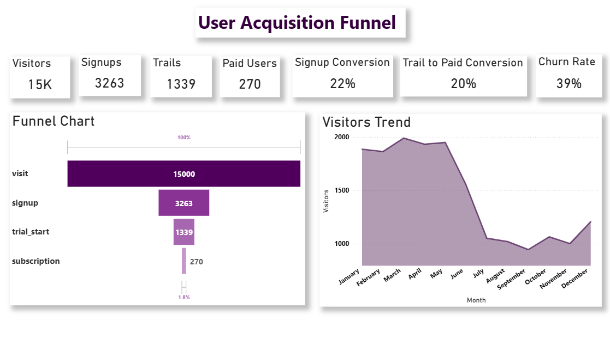
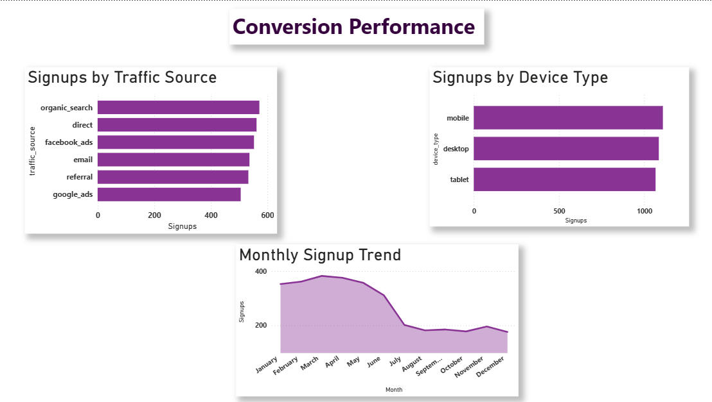
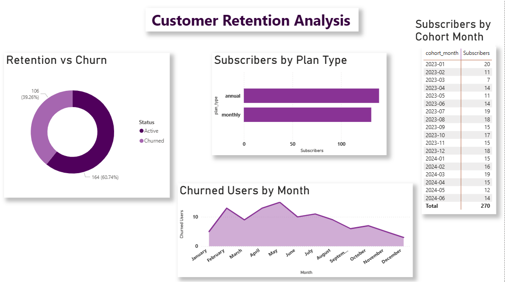

# SaaS Product Funnel & Conversion Analysis
### Product Analytics Project | SQL • Python • Power BI

Product Funnel & Conversion Analysis for a **SaaS digital product** to understand how users move through the product journey from visit to paid subscription.

This project combines **SQL analysis, Python exploration, and Power BI dashboards** to identify conversion bottlenecks, analyze acquisition performance, and evaluate customer retention behavior.

---

## Dashboard Preview

### User Acquisition Funnel

### Conversion Performance

### Customer Retention Analysis

---

# Executive Summary

SaaS products rely heavily on **user acquisition, conversion, and retention** to drive growth. Understanding how users move through the product funnel is essential for improving customer acquisition efficiency and increasing revenue.

This project analyzes a simulated SaaS product dataset to answer key business questions:

- Where do users **drop off in the product funnel**?
- What are the **conversion rates between funnel stages**?
- Which **traffic sources drive the most signups**?
- How does user behavior change across **devices**?
- What is the **customer churn rate after subscription**?

### Key Insights

- The platform contains **~15,000 visitors and 3,200+ signups**
- Only **22% of visitors convert to signup**, indicating major drop-off early in the funnel
- **41% of signups start a free trial**, showing strong interest after onboarding
- Only **20% of trial users convert to paid subscriptions**
- The product has an approximate **39% churn rate**

### Business Impact

The analysis highlights opportunities to:

- Improve **landing page conversion**
- Optimize **signup and onboarding flows**
- Increase **trial-to-paid conversion**
- Improve **customer retention strategies**

---

# Business Problem

SaaS companies need to understand how users interact with their product across the **customer journey**.

Without funnel analysis, businesses struggle to answer critical questions such as:

- Where are users **dropping off before conversion**?
- Which acquisition channels bring **high-quality users**?
- How effectively does the **free trial convert to paid subscriptions**?
- How many customers **churn after subscribing**?

Understanding these patterns enables product and marketing teams to identify bottlenecks and prioritize improvements that directly impact **growth and revenue**.

This project builds a **data-driven framework** for analyzing SaaS product funnel performance.

---

# Dataset

The dataset used in this project is a **synthetic SaaS product dataset created for analytical practice and portfolio development**.

The data was generated programmatically using **SQL scripts with AI-assisted data simulation** to replicate realistic SaaS product behavior and user interactions.

The dataset simulates common SaaS platform activity including:

- User visits
- Account signups
- Free trial activations
- Paid subscriptions
- Customer churn events

### Dataset Characteristics

- ~15,000 product visitors
- ~3,200 user signups
- ~1,300 trial activations
- ~270 paid subscriptions
- ~50,000 product interaction events
- ~18 months of simulated platform activity

The dataset structure mirrors a typical **product analytics schema**:

- **Users table** – user attributes and acquisition data  
- **Events table** – user interactions across the product funnel  
- **Subscriptions table** – subscription start dates and churn information  

This structure allows analysis of:

- Funnel conversion rates
- Acquisition channel performance
- Device usage behavior
- Customer churn and retention

---

# Methodology

The analysis was performed using **SQL, Python, and Power BI**.

### SQL Analysis

SQL was used to calculate key product funnel metrics including:

- Funnel conversion rates
- User drop-off between stages
- Traffic source performance
- Device-level conversions
- Monthly conversion trends

Techniques used:

- Joins
- Aggregations
- CTEs
- Funnel stage calculations
- Time-based analysis

---

### Python Analysis

Python was used for deeper exploratory analysis and visualization.

Key tasks performed:

- Funnel conversion visualization
- Drop-off analysis
- Conversion rate trends
- Customer churn visualization
- Cohort retention heatmap

Libraries used:

- Pandas
- NumPy
- Matplotlib

---

### Power BI Dashboard

An interactive Power BI dashboard was created to monitor product funnel performance.

Dashboard components include:

- Funnel conversion visualization
- Visitor and signup trends
- Traffic source performance
- Device conversion analysis
- Customer retention and churn analysis
- Subscription cohort overview

---

# Skills Demonstrated

### SQL
- CTEs
- Joins
- Aggregations
- Funnel analysis
- Conversion rate calculations
- Time-series analysis

### Python
- Pandas data manipulation
- Matplotlib visualization
- Numerical analysis using NumPy
- Exploratory data analysis
- Cohort analysis

### Power BI
- Data modeling
- DAX measures
- Calculated columns
- Interactive dashboards
- KPI visualization

### Product Analytics Concepts
- Funnel analysis
- Conversion optimization
- Acquisition channel analysis
- Customer churn analysis
- Cohort retention analysis

---

# Results & Business Recommendations

### Key Findings

- **78% of visitors drop before signup**, indicating potential friction in the landing page or signup process.
- **Trial activation is strong**, with over 40% of signups starting a trial.
- **Trial-to-paid conversion is relatively low**, suggesting opportunities to improve onboarding and product activation.
- **Customer churn is around 39%**, meaning retention strategies could significantly increase lifetime value.

### Business Recommendations

- Simplify the **signup process** to reduce friction.
- Improve **onboarding experience** during the trial phase.
- Introduce **product activation guidance** to encourage deeper feature usage.
- Implement **retention campaigns** to reduce subscription churn.

---

# Next Steps

Future improvements for this project could include:

- Funnel segmentation by **user demographics**
- Behavioral analysis of **high-converting users**
- A/B testing simulations for funnel optimization
- Predictive churn modeling
- Marketing campaign performance analysis

Additional behavioral data could help identify **why users drop off at specific funnel stages**.

---

# Tools Used

- SQL (MySQL)
- Python (Pandas, NumPy, Matplotlib)
- Power BI
- Jupyter Notebook

---

# How to Reproduce This Project

1. Clone the repository  
git clone https://github.com/yourusername/product-funnel-analysis-saas.git

2. Run SQL queries from the **sql** folder

3. Open the Python notebook for exploratory analysis

4. Open the Power BI dashboard to explore the interactive report

---

# Tags

`Data Analytics`  
`SQL`  
`Python`  
`Power BI`  
`Product Analytics`  
`SaaS Analytics`  
`Funnel Analysis`
